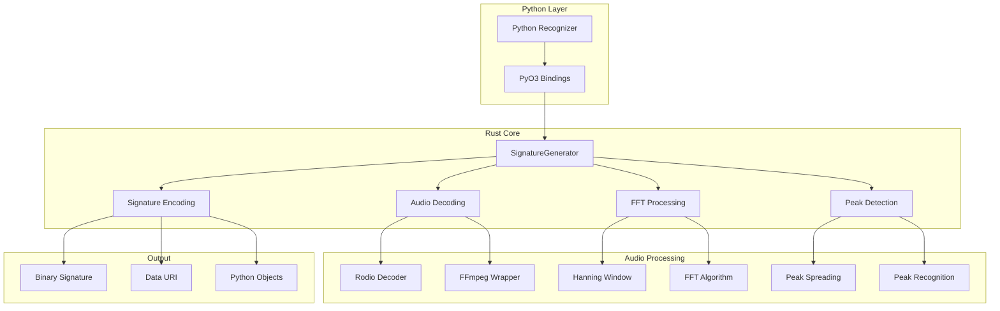
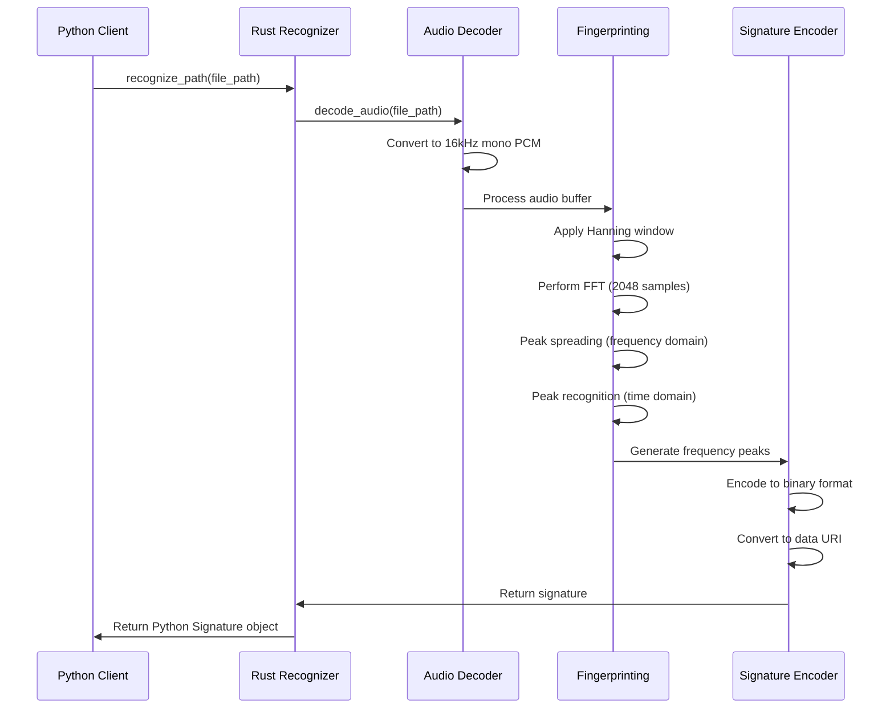

# Shazamio Core - Comprehensive Documentation

## Table of Contents
1. [Project Overview](#project-overview)
2. [Architecture Overview](#architecture-overview)
3. [Folder Structure](#folder-structure)
4. [Core Components](#core-components)
5. [Data Flow](#data-flow)
6. [API Reference](#api-reference)
7. [Build System](#build-system)
8. [Deployment](#deployment)
9. [Development Workflow](#development-workflow)

## Project Overview

**Shazamio Core** is a high-performance audio fingerprinting library that generates Shazam-compatible signatures from audio files. It's implemented as a Rust library with Python bindings using PyO3, providing both performance and ease of use.

### Key Features
- **Audio Processing**: Supports multiple audio formats (WAV, MP3, OGG, FLAC, M4A, AAC, WMA)
- **Fingerprinting Algorithm**: Implements Shazam's proprietary audio fingerprinting algorithm
- **Cross-Platform**: Works on Windows, macOS, and Linux
- **Async Support**: Full async/await support for Python integration
- **FFmpeg Integration**: Fallback to FFmpeg for unsupported audio formats

### Technology Stack
- **Rust**: Core implementation for performance-critical audio processing
- **Python**: High-level API with async support
- **PyO3**: Rust-Python bindings
- **FFmpeg**: Audio format conversion and decoding
- **Maturin**: Build system for Python wheels

## Architecture Overview



## Folder Structure

```
shazamio-core/
├── .github/
│   └── workflows/
│       └── CI.yml                 # GitHub Actions CI/CD
├── docker/
│   ├── Dockerfile.manylinux_2_28_ARM64
│   ├── Dockerfile.manylinux_2_28_X64
│   ├── Dockerfile.u2004
│   ├── build-manylinux.sh
│   ├── install-basic-deps-manylinux.sh
│   └── install-basic-deps-u2004.sh
├── shazamio_core/
│   ├── __init__.py               # Python package init
│   ├── shazamio_core.py         # Python API definitions
│   ├── shazamio_core.pyi        # Type hints
│   └── py.typed                  # PEP 561 marker
├── src/
│   ├── lib.rs                    # Main Rust library entry point
│   ├── errors.rs                 # Error handling
│   ├── params.rs                 # Search parameters
│   ├── response.rs               # Response data structures
│   ├── utils.rs                  # Utility functions
│   └── fingerprinting/
│       ├── mod.rs                # Fingerprinting module
│       ├── algorithm.rs          # Core fingerprinting algorithm
│       ├── communication.rs      # Signature communication
│       ├── ffmpeg_wrapper.rs     # FFmpeg integration
│       ├── hanning.rs            # Hanning window coefficients
│       └── signature_format.rs   # Signature encoding/decoding
├── Cargo.toml                    # Rust dependencies
├── pyproject.toml               # Python package configuration
├── poetry.lock                  # Python dependencies lock
├── Cargo.lock                   # Rust dependencies lock
├── LICENSE                      # MIT License
├── README.md                    # Basic project description
└── .gitignore                   # Git ignore rules
```

## Core Components

### 1. Python API Layer (`shazamio_core/`)

#### `shazamio_core.py`
Defines the Python interface with the following classes:

```python
@dataclass
class Geolocation:
    altitude: int
    latitude: int
    longitude: int

@dataclass
class SignatureSong:
    samples: int
    timestamp: int
    uri: str

@dataclass
class Signature:
    geolocation: Geolocation
    signature: SignatureSong
    timestamp: int
    timezone: str

@dataclass(frozen=True)
class SearchParams:
    segment_duration_seconds: int = 10

class SignatureError(Exception):
    # Custom exception for signature generation errors

class Recognizer:
    # Main interface for audio recognition
    async def recognize_path(self, value: Union[str, PathLike], options: Optional[SearchParams] = None) -> Signature
    async def recognize_bytes(self, value: bytes, options: Optional[SearchParams] = None) -> Signature
```

### 2. Rust Core (`src/`)

#### `lib.rs` - Main Entry Point
```rust
#[pymodule]
fn shazamio_core(_py: Python<'_>, m: &PyModule) -> PyResult<()> {
    // Exports Python classes
    m.add_class::<Recognizer>()?;
    m.add_class::<SignatureError>()?;
    m.add_class::<Geolocation>()?;
    m.add_class::<SignatureSong>()?;
    m.add_class::<Signature>()?;
    m.add_class::<SearchParams>()?;
    Ok(())
}
```

#### `fingerprinting/algorithm.rs` - Core Algorithm
The heart of the fingerprinting system:

```rust
pub struct SignatureGenerator {
    ring_buffer_of_samples: Vec<i16>,
    reordered_ring_buffer_of_samples: Vec<f32>,
    fft_outputs: Vec<Vec<f32>>,
    spread_fft_outputs: Vec<Vec<f32>>,
    ring_buffer_of_samples_index: usize,
    fft_outputs_index: usize,
    fft_object: RFft1D<f32>,
    spread_fft_outputs_index: usize,
    num_spread_ffts_done: u32,
    signature: DecodedSignature,
}
```

**Key Methods:**
- `make_signature_from_bytes()`: Process raw audio bytes
- `make_signature_from_file()`: Process audio file from path
- `make_signature_from_buffer()`: Process PCM audio buffer
- `do_fft()`: Perform Fast Fourier Transform
- `do_peak_spreading()`: Spread peak values in frequency domain
- `do_peak_recognition()`: Detect and store frequency peaks

#### `fingerprinting/signature_format.rs` - Signature Encoding
```rust
pub struct DecodedSignature {
    pub sample_rate_hz: u32,
    pub number_samples: u32,
    pub frequency_band_to_sound_peaks: HashMap<FrequencyBand, Vec<FrequencyPeak>>,
}

pub enum FrequencyBand {
    _250_520 = 0,
    _520_1450 = 1,
    _1450_3500 = 2,
    _3500_5500 = 3,
}
```

**Encoding Methods:**
- `encode_to_binary()`: Generate binary signature format
- `encode_to_uri()`: Generate data URI for web transmission

#### `fingerprinting/ffmpeg_wrapper.rs` - Audio Format Support
Provides fallback decoding for unsupported audio formats:

```rust
pub fn decode_with_ffmpeg(file_path: &str) -> Option<Decoder<BufReader<File>>>
pub fn decode_with_ffmpeg_from_bytes(bytes: &[u8]) -> Result<Decoder<Cursor<Vec<u8>>>, Box<dyn Error>>
```

### 3. Data Structures

#### Response Types (`src/response.rs`)
```rust
#[derive(Clone, Serialize, Deserialize)]
#[pyclass]
pub(crate) struct Geolocation {
    pub(crate) altitude: i16,
    pub(crate) latitude: i8,
    pub(crate) longitude: i8,
}

#[derive(Clone, Serialize, Deserialize)]
#[pyclass]
pub(crate) struct SignatureSong {
    pub(crate) samples: u32,
    pub(crate) timestamp: u32,
    pub(crate) uri: String,
}

#[derive(Clone, Serialize, Deserialize)]
#[pyclass]
pub(crate) struct Signature {
    pub(crate) geolocation: Geolocation,
    pub(crate) signature: SignatureSong,
    pub(crate) timestamp: u32,
    pub(crate) timezone: String,
}
```

## Data Flow



### Audio Processing Pipeline

1. **Audio Decoding**
   - Try Rodio decoder first (WAV, MP3, OGG, FLAC)
   - Fallback to FFmpeg for unsupported formats
   - Convert to 16kHz mono PCM

2. **Segment Selection**
   - Default: 10-second segment
   - For longer files: extract centered segment
   - For shorter files: use entire file

3. **FFT Processing**
   - 2048-sample Hanning window
   - 128-sample chunks with 50% overlap
   - 1025 frequency bins (0-8kHz)

4. **Peak Detection**
   - Frequency-domain spreading
   - Time-domain spreading
   - Peak magnitude thresholding
   - Frequency range filtering (250Hz-5.5kHz)

5. **Signature Generation**
   - Group peaks by frequency bands
   - Encode to binary format
   - Generate data URI for transmission

## API Reference

### Python API

#### Recognizer Class
```python
class Recognizer:
    def __init__(self, segment_duration_seconds: int = 10)
    
    async def recognize_path(
        self,
        value: Union[str, PathLike],
        options: Optional[SearchParams] = None
    ) -> Signature
    
    async def recognize_bytes(
        self,
        value: bytes,
        options: Optional[SearchParams] = None
    ) -> Signature
```

#### SearchParams Class
```python
@dataclass(frozen=True)
class SearchParams:
    segment_duration_seconds: int = 10
```

#### Signature Classes
```python
@dataclass
class Geolocation:
    altitude: int
    latitude: int
    longitude: int

@dataclass
class SignatureSong:
    samples: int
    timestamp: int
    uri: str

@dataclass
class Signature:
    geolocation: Geolocation
    signature: SignatureSong
    timestamp: int
    timezone: str
```

### Rust API

#### SignatureGenerator
```rust
impl SignatureGenerator {
    pub fn make_signature_from_bytes(
        bytes: Vec<u8>, 
        segment_duration_seconds: Option<u32>
    ) -> Result<DecodedSignature, Box<dyn Error>>
    
    pub fn make_signature_from_file(
        file_path: &str, 
        segment_duration_seconds: Option<u32>
    ) -> Result<DecodedSignature, Box<dyn Error>>
    
    pub fn make_signature_from_buffer(
        s16_mono_16khz_buffer: Vec<i16>
    ) -> DecodedSignature
}
```

## Build System

### Rust Configuration (`Cargo.toml`)
```toml
[package]
name = "shazamio-core"
version = "1.1.2"
edition = "2021"
rust-version = "1.62"

[dependencies]
tokio = "1.43.0"
tempfile = "3.16.0"
rodio = "0.20.1"
serde_json = "1.0.138"
blocking = "1.5.1"
byteorder = "1.5.0"
crc32fast = "1.4.2"
base64 = "0.22.1"
chfft = "0.3.4"
futures = "0.3.31"
serde = "1.0.217"
bytes = "1.10.0"
pyo3 = "=0.20.2"
pyo3-asyncio = "0.20.0"
pyo3-log = "=0.8.4"
log = "0.4.20"
```

### Python Configuration (`pyproject.toml`)
```toml
[tool.poetry]
name = "shazamio_core"
version = "1.1.2"
description = ""
authors = ["dotX12 <dev@shitposting.team>"]
readme = "README.md"
packages = [{include = "shazamio_core"}]

[build-system]
requires = ["maturin>=1.4.0"]
build-backend = "maturin"

[tool.maturin]
bindings = "pyo3"
```

## Deployment

### CI/CD Pipeline (`.github/workflows/CI.yml`)

The project uses GitHub Actions for automated builds across multiple platforms:

1. **Windows Builds**
   - Python versions: 3.9, 3.10, 3.11, 3.12
   - Architectures: x64, x86
   - Uses PyO3/maturin-action

2. **macOS Builds**
   - macOS 13 (x86_64) and macOS-latest (arm64)
   - Python versions: 3.9, 3.10, 3.11, 3.12
   - Supports both Intel and Apple Silicon

3. **Linux Builds**
   - Uses Docker containers for manylinux compatibility
   - ARM64 and x64 architectures
   - Ensures wheel compatibility across Linux distributions

### Docker Support (`docker/`)

Multiple Docker configurations for cross-platform builds:

- `Dockerfile.manylinux_2_28_ARM64`: ARM64 Linux builds
- `Dockerfile.manylinux_2_28_X64`: x64 Linux builds
- `Dockerfile.u2004`: Ubuntu 20.04 builds

## Development Workflow

### Prerequisites
- Rust 1.62+
- Python 3.9+
- FFmpeg (optional, for extended format support)
- Maturin (for building Python wheels)

### Building
```bash
# Install maturin
pip install maturin

# Build in development mode
maturin develop

# Build wheels
maturin build --release
```

### Testing
```python
import asyncio
from shazamio_core import Recognizer, SearchParams

async def test_recognition():
    recognizer = Recognizer(segment_duration_seconds=10)
    
    # Recognize from file
    signature = await recognizer.recognize_path("audio.mp3")
    print(f"Signature URI: {signature.signature.uri}")
    
    # Recognize from bytes
    with open("audio.mp3", "rb") as f:
        audio_bytes = f.read()
    signature = await recognizer.recognize_bytes(audio_bytes)
    print(f"Signature URI: {signature.signature.uri}")

# Run test
asyncio.run(test_recognition())
```

### Key Dependencies

#### Rust Dependencies
- **tokio**: Async runtime for non-blocking I/O
- **rodio**: Audio decoding and processing
- **chfft**: Fast Fourier Transform implementation
- **pyo3**: Python bindings
- **serde**: Serialization for data structures
- **tempfile**: Temporary file handling for FFmpeg

#### Python Dependencies
- **maturin**: Build system for Rust-Python bindings
- **poetry**: Dependency management (development)

## Performance Characteristics

### Audio Processing
- **Sample Rate**: 16kHz (downsampled from original)
- **Channels**: Mono (converted from stereo if needed)
- **Segment Duration**: Configurable (default 10 seconds)
- **FFT Size**: 2048 samples with Hanning window
- **Overlap**: 50% (128-sample chunks)

### Memory Usage
- **Ring Buffer**: 2048 samples (16-bit)
- **FFT Outputs**: 256 × 1025 float arrays
- **Peak Storage**: Frequency-band organized peaks

### Supported Audio Formats
- **Primary**: WAV, MP3, OGG, FLAC (via Rodio)
- **Extended**: M4A, AAC, WMA, OPUS (via FFmpeg)
- **Fallback**: Any format supported by FFmpeg

## Error Handling

### Error Types
```rust
pub struct SignatureError {
    message: String,
}
```

### Common Error Scenarios
1. **Audio Decoding Failures**: Unsupported formats or corrupted files
2. **FFmpeg Not Available**: Missing FFmpeg installation
3. **File System Errors**: Invalid paths or permissions
4. **Memory Errors**: Insufficient memory for large files
5. **FFT Processing Errors**: Invalid audio data

### Error Propagation
- Rust errors are converted to Python exceptions
- Async errors are properly propagated through PyO3
- Detailed error messages for debugging

## Future Enhancements

### Potential Improvements
1. **GPU Acceleration**: CUDA/OpenCL FFT implementation
2. **Streaming Support**: Real-time audio processing
3. **Batch Processing**: Multiple file processing
4. **Custom Formats**: Additional audio format support
5. **Performance Optimization**: SIMD instructions for FFT
6. **Memory Optimization**: Streaming audio processing
7. **Extended Metadata**: Additional audio information extraction

### API Extensions
1. **Progress Callbacks**: Real-time processing feedback
2. **Configuration Options**: More granular control
3. **Batch Operations**: Multiple file processing
4. **Streaming Interface**: Real-time audio input
5. **Custom Algorithms**: Pluggable fingerprinting algorithms

This documentation provides a comprehensive overview of the shazamio-core codebase, including its architecture, components, data flow, and usage patterns. It serves as a foundation for understanding the codebase and can be used as a reference for future development tasks. 